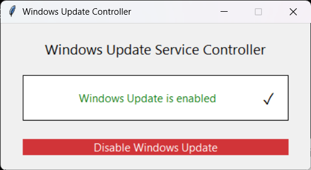
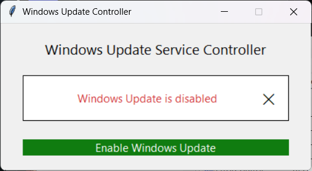

# WindowsUpdateDisabler

GUI utility to enable or disable the **Windows Update (wuauserv)** service by modifying its service `ImagePath` registry entry.

Built with **Python + Tkinter**.

## What It Does

* Detects current Windows Update state
* Toggles the service by swapping:

  * `svchost.exe` ↔ `svchost0.exe`
* Updates take effect immediately

## How It Works (Technical)

The tool reads and writes:

```
HKLM\SYSTEM\CurrentControlSet\Services\wuauserv\ImagePath
```

If `ImagePath` points to `svchost.exe`, Windows Update is considered **enabled**.
If it points to `svchost0.exe`, it is considered **disabled**.

This prevents the Windows Update service from starting **and immediately breaks it if it is already running**.

## Compatibility

* Windows versions that expose the `wuauserv` service registry key:

  * Windows 7
  * Windows 8 / 8.1
  * Windows 10
  * Windows 11
  * Windows Server (corresponding releases)

Not tested on versions older than Windows 7.

## Requirements

* Administrator privileges (mandatory)
* Python 3.x (only if running from source)

## Usage

Run the executable **as Administrator**.

If running from source, the Python process **must be launched from an elevated (Administrator) command prompt**.

Or from source:

```
python main.py
```

## Builds

Prebuilt binaries are produced automatically via **GitHub Actions**.

## Important Notes

* Microsoft Store and some Windows components rely on Windows Update.
* To install Store apps, temporarily re-enable Windows Update.
* When disabling, the tool creates a SYSTEM-level scheduled task (PersistWUADisable) that re-applies the registry change on every boot.
* This persistence is automatically removed when you re-enable Windows Update via the tool.
* This tool does not uninstall or permanently break Windows Update.

## Screenshots

### Windows Update Enabled



### Windows Update Disabled



## Warnings

* Direct registry modification
* No warranty, use at your own risk

## License

MIT
